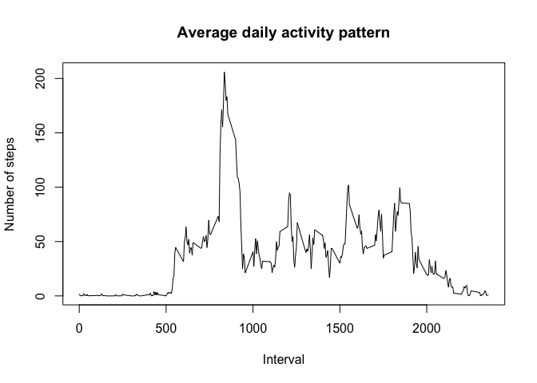

## Loading and preprocessing the data

```r
#Load packages
library(dplyr)
```

```
## 
## Attaching package: 'dplyr'
```

```
## The following objects are masked from 'package:stats':
## 
##     filter, lag
```

```
## The following objects are masked from 'package:base':
## 
##     intersect, setdiff, setequal, union
```

```r
library(ggplot2)

# Download and unzip file if it does not exist
zipURL <- "https://d396qusza40orc.cloudfront.net/repdata%2Fdata%2Factivity.zip"
zipfile <- "activity.zip"

if (!file.exists(zipfile)) {
  download.file(zipURL, zipfile, method = "curl")
}

dataset.name <- "activity.csv"
if (!file.exists(dataset.name)) {
  unzip(zipfile)
}

# Read data
activitydata <- read.csv(dataset.name, header = TRUE)

# Convert date variable into data class
activitydata$date <- as.Date(activitydata$date, format = "%Y-%m-%d")
```

## What is mean total number of steps taken per day?

Calculate total number of steps taken per day

```r
# Calculate total number of steps taken per day
total.steps <- activitydata %>% 
  group_by(date) %>%
  summarize(sum(steps))
colnames(total.steps) = c("date", "steps")
```

Create histogram of total number of steps taken each day

```r
hist(total.steps$steps, 
     breaks = 5, 
     xlab = "Steps",
     main = "Histogram of the total number of steps per day",
     ylim = range(0, 30),
     col = "light blue")
```

<!-- -->

Calculate and report the mean and median of the total number of steps taken per day

```r
# Mean total number of steps taken per day
mean.steps <- as.integer(mean(total.steps$steps, na.rm = TRUE))

# Median total number of steps taken per day
median.steps <- as.integer(median(total.steps$steps, na.rm = TRUE))
```
The mean number of steps taken per day is 10766.
The median number of steps taken per day is 10765.

## What is the average daily activity pattern?

Make a time series plot  (i.e. type = "l") of the 5-minute interval (x-axis) and the average number of steps taken, averaged across all days (y-axis)

```r
# Calculate average number of steps taken across all days, by interval
stepsbyinterval <- activitydata %>% 
  group_by(interval) %>%
  summarize(mean(steps, na.rm = TRUE))
colnames(stepsbyinterval) = c("interval", "steps")

# Plot average steps by interval
plot(stepsbyinterval$interval,
     as.numeric(stepsbyinterval$steps), 
     type = "l",
     main = "Average daily activity pattern",
     xlab = "Interval",
     ylab = "Number of steps"
     )
```

<!-- -->

Which 5-minute interval, on average across all the days in the dataset, contains the maximum number of steps?

```r
max.steps <- max(stepsbyinterval$steps)
max.interval <- stepsbyinterval[stepsbyinterval$steps==max.steps, 1]
```
The maximum number of steps is 206.1698113, at interval 835.

## Imputing missing values

Calculate and report the total number of missing values in the dataset (i.e. the total number of rows with NAs).

```r
NA.sum <- sum(is.na(activitydata$steps))
```
There are 2304 missing values in the dataset.

Devise a strategy for filling in all of the missing values in the dataset. The strategy does not need to be sophisticated. For example, you could use the mean/median for that day, or the mean for that 5-minute interval, etc.

My strategy is to replace NAs with the mean across all days for that 5-minute interval. 

Create a new dataset that is equal to the original dataset but with the missing data filled in.

```r
# First, merge original activity dataset with mean steps per interval and assign it to new dataset
activitydata2 <- merge(activitydata, stepsbyinterval, by = "interval", suffixes = c(".original", ".mean"))

# Find rows with NAs
NArows <- which(is.na(activitydata2$steps.original))

# Replace missing values with mean of that interval
activitydata2[NArows, "steps.original"] = activitydata2[NArows, "steps.mean"]

# Clean up new dataset
activitydata2 <- activitydata2[,1:3] # Drop mean steps per interval column
colnames(activitydata2) <- c("interval", "steps", "date") # Rename columns
activitydata2$steps <- signif(activitydata2$steps, digits = 2) # Reduce number of decimal places 
```

Make a histogram of the total number of steps taken each day and calculate and report the mean and median total number of steps taken per day. Do these values differ from the estimates from the first part of the assignment? What is the impact of imputing missing data on the estimates of the total daily number of steps?

Create histogram

```r
# Calculate total number of steps taken per day
total.steps2 <- activitydata2 %>% 
  group_by(date) %>%
  summarize(sum(steps))
colnames(total.steps2) = c("date", "steps")

# Create histogram of total number of steps taken each day
hist(total.steps2$steps, 
     breaks = 5, 
     xlab = "Steps",
     main = "Histogram of the total number of steps per day, using imputed data",
     ylim = range(0, 40),
     col = "light blue")
```

<!-- -->

Calculate mean and median steps per day, report difference from original data

```r
# Mean total number of steps taken per day
mean.steps2 <- as.integer(mean(total.steps2$steps, na.rm = TRUE))

# Median total number of steps taken per day
median.steps2 <- as.integer(median(total.steps2$steps, na.rm = TRUE))
```
The new mean number of steps taken per day is 10765, compared to the original mean of 10766.
The new median number of steps taken per day is 10769, compared to the original median of 10765.

## Are there differences in activity patterns between weekdays and weekends?

For this part the weekdays() function may be of some help here. Use the dataset with the filled-in missing values for this part.

Create a new factor variable in the dataset with two levels – “weekday” and “weekend” indicating whether a given date is a weekday or weekend day.

```r
# Create new column for factor variable
activitydata2$day <- ifelse(weekdays(as.Date(activitydata2$date)) == "Saturday" | weekdays(as.Date(activitydata2$date)) == "Sunday", "weekend", "weekday")
```

Make a panel plot containing a time series plot (i.e. type="l") of the 5-minute interval (x-axis) and the average number of steps taken, averaged across all weekday days or weekend days (y-axis).

```r
# Calculate average number of steps taken across all weekdays or weekend days
stepsbyday <- activitydata2 %>% 
  group_by(interval, day) %>%
  summarize(mean(steps, na.rm = TRUE))
colnames(stepsbyday) = c("interval", "day", "steps")

# Make panel plot
ggplot(stepsbyday, aes(interval, steps)) + 
  geom_line() +
  facet_grid(day ~ .) +
  labs(x = "Interval", 
       y = "Average number of steps") +
    ggtitle("Average daily activity pattern by weekday versus weekend") +    
    theme_bw() + 
    theme(plot.title = element_text(hjust = 0.5)) +
    theme(strip.background = element_rect(fill = "light blue")) 
```

<!-- -->

